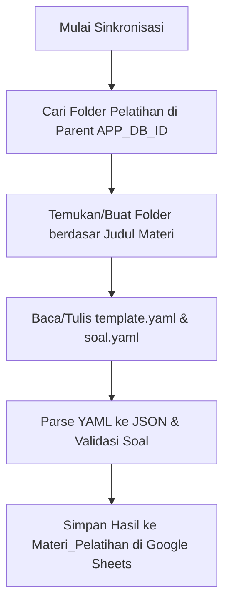

# Dokumen Desain Perangkat Lunak: Modul Pelatihan (Training of Trainers - ToT)
**Sistem Pengawas KBC**

---

## 1. Pendahuluan
Dokumen ini menyajikan arsitektur teknis, desain basis data, spesifikasi API, serta alur sistem untuk **Modul Pelatihan (ToT)** pada aplikasi Pengawas KBC. Dokumentasi ini disusun oleh Arsitek Perangkat Lunak Profesional dengan tujuan untuk mempermudah pemeliharaan, pengembangan berkelanjutan (extensibility), dan orientasi bagi pengembang baru.

### 1.1 Deskripsi Modul
Modul Pelatihan memfasilitasi pelaksanaan pelatihan pengawas madrasah oleh Pelatih (Trainer). Modul ini mengintegrasikan siklus hidup pelatihan (pembuatan jadwal, manajemen peserta, penyusunan materi berbasis YAML, pelaksanaan Pre-Test & Post-Test, hingga analisis statistik efektivitas pelatihan).

### 1.2 Aktor Sistem
1. **Pelatih (Trainer/ToT)**: Pengguna yang membuat jadwal, menentukan materi, mendaftarkan peserta secara manual, mengontrol waktu pembukaan/penutupan ujian, dan melihat analisis peningkatan kapasitas peserta.
2. **Peserta (Pengawas)**: Pengguna yang mengikuti pelatihan, bergabung melalui kode undangan (invite code), mengakses materi pelatihan (lembar kerja), dan mengerjakan Pre-Test/Post-Test.

---

## 2. Arsitektur Modul & Siklus Hidup (Lifecycle)

### 2.1 Siklus Hidup Pelatihan (State Machine)
Pelatihan memiliki tiga status utama yang dikendalikan secara transisi sekuensial:

```mermaid
stateDiagram-v2
    [*] --> DRAFT : Pembuatan Jadwal (apiCreatePelatihan)
    DRAFT --> DRAFT : Update Data / Tambah Peserta / Sinkronisasi Materi
    DRAFT --> AKTIF : Aktivasi Pelatihan (apiAktivasiPelatihan)
    note right of AKTIF: Syarat Aktivasi:\n- Minimal 1 Peserta\n- Minimal 1 Materi\n- Set Soal Terkonfigurasi
    AKTIF --> AKTIF : Buka/Tutup Pre-Test & Post-Test\nPeserta Mengerjakan LK & Test
    AKTIF --> SELESAI : Selesaikan Pelatihan (apiSelesaikanPelatihan)
    note right of SELESAI: Penutupan otomatis semua test aktif.\nStatus peserta diset "selesai".
    SELESAI --> [*]
```

### 2.2 Alur Bergabung Peserta (Join Flow)
Ada dua metode pendaftaran peserta pelatihan:
1. **Direct Invite**: Pelatih mencari profil pengawas di provinsi yang sama dan menambahkannya langsung ke database.
2. **Invite Code (Self-Enrollment)**: Pelatih membagikan 4-karakter kode undangan unik. Peserta memasukkan kode tersebut di dashboard mereka.

---

## 3. Desain Basis Data & Skema Sheet
Sistem ini menggunakan Google Sheets sebagai Database Engine. Berikut adalah skema tabel (sheets) yang relevan dengan Modul Pelatihan:

### 3.1 Skema `Pelatihan`
Menyimpan informasi utama identitas dan metadata pelatihan.

| Nama Kolom | Tipe Data | Deskripsi | Constraints |
| :--- | :--- | :--- | :--- |
| `pelatihan_id` | String | ID unik pelatihan (format: `PLT-[UUID_8]`) | Primary Key |
| `judul` | String | Judul kegiatan pelatihan | Required |
| `deskripsi` | String | Keterangan detail atau deskripsi kegiatan | Optional |
| `nip_pelatih` | String | NIP Pelatih yang bertanggung jawab | Foreign Key -> `Profil(NIP)` |
| `provinsi` | String | Provinsi jangkauan pelatihan | Required |
| `tanggal_mulai` | ISO Date/String| Tanggal dimulainya pelatihan | Required |
| `tanggal_selesai` | ISO Date/String| Tanggal berakhirnya pelatihan | Required |
| `status` | String | Status pelatihan (`draft`, `aktif`, `selesai`) | Default: `draft` |
| `invite_code` | String | 4-karakter kode undangan unik | Generated, e.g. `H3K9` |
| `invite_status`| String | Status penerimaan undangan (`open`, `closed`) | Default: `open` |
| `created_at` | ISO Timestamp | Waktu pembuatan data | Generated |
| `updated_at` | ISO Timestamp | Waktu modifikasi terakhir data | Generated |

### 3.2 Skema `PelatihanPeserta`
Menyimpan relasi Many-to-Many antara `Pelatihan` dan `Profil` pengawas.

| Nama Kolom | Tipe Data | Deskripsi | Constraints |
| :--- | :--- | :--- | :--- |
| `pelatihan_id` | String | ID pelatihan terkait | Composite Key, FK -> `Pelatihan` |
| `nip_peserta` | String | NIP Pengawas yang terdaftar sebagai peserta | Composite Key, FK -> `Profil` |
| `nama_peserta` | String | Nama lengkap peserta (denormalisasi untuk optimasi) | - |
| `kabupaten` | String | Kabupaten asal peserta | - |
| `status` | String | Status keikutsertaan (`terdaftar`, `aktif`, `hadir`, `selesai`)| Default: `terdaftar` |

### 3.3 Skema `PelatihanMateri`
Menyimpan daftar materi yang digunakan pada pelatihan spesifik.

| Nama Kolom | Tipe Data | Deskripsi | Constraints |
| :--- | :--- | :--- | :--- |
| `pelatihan_id` | String | ID pelatihan terkait | Composite Key, FK -> `Pelatihan` |
| `materi_id` | String | ID materi terkait | Composite Key, FK -> `Materi_Pelatihan`|
| `urutan` | Integer | Urutan penyajian materi (1, 2, dst) | - |
| `judul_materi` | String | Judul materi (denormalisasi) | - |

### 3.4 Skema `Materi_Pelatihan`
Menyimpan definisi pustaka materi global yang tersedia di sistem.

| Nama Kolom | Tipe Data | Deskripsi | Constraints |
| :--- | :--- | :--- | :--- |
| `materi_id` | String | ID materi unik | Primary Key |
| `judul_materi` | String | Judul modul/materi | Required |
| `deskripsi` | String | Keterangan singkat materi | - |
| `konfigurasi_template` | JSON String | Struktur materi & link LK hasil parse `template.yaml`| Saved JSON |
| `konfigurasi_soal` | String | Teks YAML mentah yang berisi soal-soal evaluasi | Saved YAML string |

### 3.5 Skema `PrePostSoal`
Menampung konfigurasi ujian Pre/Post Test aktif yang dirangkai untuk suatu pelatihan.

| Nama Kolom | Tipe Data | Deskripsi | Constraints |
| :--- | :--- | :--- | :--- |
| `soal_id` | String | ID unik set soal (format: `SOAL-[UUID_8]`) | Primary Key |
| `pelatihan_id` | String | ID pelatihan pemilik soal | Foreign Key -> `Pelatihan` |
| `yaml_definition`| String | Definisi soal lengkap dalam format YAML | Required |
| `status_pre` | String | Status pembukaan Pre-Test (`draft`, `aktif`, `ditutup`)| Default: `draft` |
| `status_post` | String | Status pembukaan Post-Test (`draft`, `aktif`, `ditutup`)| Default: `draft` |
| `pre_dibuka_pada` | ISO Timestamp | Waktu pembukaan Pre-Test | Optional |
| `pre_ditutup_pada`| ISO Timestamp | Waktu penutupan Pre-Test | Optional |
| `post_dibuka_pada`| ISO Timestamp | Waktu pembukaan Post-Test | Optional |
| `post_ditutup_pada`| ISO Timestamp | Waktu penutupan Post-Test | Optional |

### 3.6 Skema `PrePostResponses`
Menyimpan rekam jawaban dan skor hasil pengerjaan peserta.

| Nama Kolom | Tipe Data | Deskripsi | Constraints |
| :--- | :--- | :--- | :--- |
| `response_id` | String | ID unik lembar jawaban | Primary Key |
| `soal_id` | String | ID set soal yang digunakan | Foreign Key -> `PrePostSoal` |
| `pelatihan_id` | String | ID pelatihan | Foreign Key -> `Pelatihan` |
| `nip_peserta` | String | NIP Pengawas yang menjawab | Foreign Key -> `Profil` |
| `tipe` | String | Tipe pengerjaan (`pretest`, `posttest`) | Required |
| `jawaban_json` | JSON String | Map jawaban peserta (`{ nama_soal: value }`) | Raw answers |
| `skor_total` | Float/Double | Nilai akhir dalam skala 0 - 100 | Generated |
| `skor_kategori_json`| JSON String | Detil nilai per kategori kompetensi | `{ "Kategori A": 80 }` |
| `seed_used` | String | Seed acak yang digunakan saat pengerjaan | Untuk audit auditabilitas |
| `timestamp` | ISO Timestamp | Waktu pengiriman jawaban | Generated |

---

## 4. Antarmuka Pemrograman Aplikasi (API Server Specifications)

Seluruh fungsi backend diimplementasikan di `Pelatihan.js` dan `PrePostTest.js` sebagai Google Apps Script custom functions yang dipanggil menggunakan `google.script.run`.

### 4.1 Modul `Pelatihan.js`

#### `apiGetPelatihanList(nipPelatih)`
*   **Tujuan**: Mengambil daftar pelatihan yang dikelola oleh seorang pelatih.
*   **Parameter**: `nipPelatih` (String) - NIP dari pelatih.
*   **Return**: Standard API Success Response `[Pelatihan]` yang di-enrich dengan properti `peserta_count` dan `materi_count` dari sheet terkait, disorting terbaru.

#### `apiGetPelatihanDetail(pelatihanId)`
*   **Tujuan**: Mengambil informasi detail pelatihan yang mencakup data utama, daftar peserta, materi yang terpilih, dan status test terasosiasi.
*   **Parameter**: `pelatihanId` (String).
*   **Return**: Sukses mengembalikan objek:
    ```json
    {
      "pelatihan": { ... },
      "peserta": [ ... ],
      "materi": [ ... ],
      "test": { ... }
    }
    ```
*   **Fitur Tambahan**: Mengenerate otomatis `invite_code` (4-char random) jika belum ada di database.

#### `apiCreatePelatihan(payload)`
*   **Tujuan**: Membuat jadwal pelatihan baru berstatus `draft`.
*   **Parameter**: `payload` (Object: `{ judul, deskripsi, nip_pelatih, provinsi, tanggal_mulai, tanggal_selesai }`).
*   **Validasi**: `judul`, `nip_pelatih`, dan `provinsi` wajib diisi.

#### `apiUpdatePelatihan(pelatihanId, payload)`
*   **Tujuan**: Mengubah metadata jadwal pelatihan.
*   **Validasi**: Modifikasi hanya diizinkan apabila status pelatihan masih `draft`.

#### `apiDeletePelatihan(pelatihanId)`
*   **Tujuan**: Menghapus pelatihan beserta seluruh data dependensi di sheet `PelatihanPeserta`, `PelatihanMateri`, `PrePostSoal`, dan `PrePostResponses`.
*   **Validasi**: Hanya pelatihan berstatus `draft` yang dapat dihapus.

#### `apiAktivasiPelatihan(pelatihanId)`
*   **Tujuan**: Mengubah status pelatihan dari `draft` ke `aktif`.
*   **Validasi**: Pelatihan harus memiliki minimal 1 peserta, minimal 1 materi, dan set soal Pre/Post Test harus sudah dibuat.

#### `apiSelesaikanPelatihan(pelatihanId)`
*   **Tujuan**: Mengakhiri pelatihan (status `selesai`). Menutup semua Pre-Test & Post-Test yang masih terbuka secara otomatis.

---

### 4.2 Modul `PrePostTest.js` (Paling Kritikal)

#### Mekanisme Keamanan Distribusi Ujian
Untuk mencegah kecurangan (inspect element di browser peserta), sistem dirancang menggunakan **Server-Side Grading**:
1. Fungsi `apiGetTestUntukPeserta` memuat file YAML dari database, mengacak soal dan opsi menggunakan algoritma seeded LCG (Linear Congruential Generator) agar hasil pengacakan tetap sama selama sesi pengerjaan peserta, namun **membuang atribut `answer` (kunci jawaban)** sebelum mengirimkan JSON ke browser peserta.
2. Evaluasi jawaban dilakukan sepenuhnya di sisi server melalui fungsi `apiSubmitTestJawaban`, di mana jawaban peserta dibandingkan dengan YAML asli yang tersimpan aman di server Google Apps Script.

#### `apiGetTestUntukPeserta(soalId, nipPeserta, tipe)`
*   **Tujuan**: Menghasilkan daftar pertanyaan yang aman (tanpa kunci jawaban) untuk peserta.
*   **Proses**:
    *   Memastikan status test (`status_pre` atau `status_post`) bernilai `'aktif'`.
    *   Memeriksa apakah peserta sudah pernah mengirimkan jawaban sebelumnya pada tipe test yang sama.
    *   Melakukan seeded random shuffling untuk soal dan opsi pilihan jawaban berdasarkan kombinasi `soalId + nipPeserta + tipe`.
*   **Return**: JSON schema soal yang aman.

#### `apiSubmitTestJawaban(soalId, nipPeserta, tipe, jawaban)`
*   **Tujuan**: Memproses lembar jawaban, melakukan perhitungan skor di sisi server, dan menyimpan hasil pengerjaan.
*   **Algoritma Penilaian (Grading Engine)**:
    *   **Radio & Boolean**: Skor `1.0` jika benar, `0.0` jika salah (case-insensitive).
    *   **Checkbox**: Skor proporsional dengan penalti jawaban salah. `Skor = (Jawaban Benar Terpilih - Jawaban Salah Terpilih) / Total Kunci Jawaban`. Skor minimal dibatasi `0.0`.
    *   **Matching**: Mencocokkan pasangan kunci-nilai. `Skor = Jumlah Pasangan Benar / Total Pasangan Kunci`.
    *   **Kategori**: Akumulasi skor rata-rata dihitung terpisah berdasarkan metadata `category` pada tiap item soal YAML.

---

## 5. Sinkronisasi YAML Materi & Berkas Google Drive

Integrasi data materi dirancang fleksibel melalui dokumen berbasis teks YAML yang diletakkan di Google Drive:

### 5.1 Alur Integrasi File YAML


### 5.2 Contoh Format File `soal.yaml`
```yaml
title: "Evaluasi Pemahaman Dasar KBC"
description: "Soal evaluasi pemahaman baseline untuk pengawas"
shuffle_questions: true
shuffle_options: true
time_limit_minutes: 30

questions:
  - type: radio
    name: q1
    label: "Siapa penanggung jawab evaluasi mutu KBC?"
    options:
      - "Pelatih"
      - "Pengawas Madrasah"
      - "Kepala Madrasah"
      - "Kantor Wilayah"
    answer: "Pengawas Madrasah"
    category: "Peran Pengawas"

  - type: checkbox
    name: q2
    label: "Pilih aspek-aspek utama dalam penilaian KBC (Pilih 2):"
    options:
      - "Kedisiplinan"
      - "Rasio Keuangan"
      - "Kinerja Akademis"
      - "Luas Lahan"
    answer: ["Kedisiplinan", "Kinerja Akademis"]
    category: "Metrik Penilaian"
```

---

## 6. Antarmuka Pengguna & Manajemen State Frontend
Sistem menggunakan modul SPA (Single Page Application) berbasis Google Apps Script HTML service.

### 6.1 State Management (`PelatihanManager` pada `js-pelatihan.html`)
Di sisi klien, objek `PelatihanManager` bertindak sebagai pengendali state lokal:
*   `PelatihanManager.detailData`: Menyimpan data pelatihan saat ini (aktif di-render di detail view).
*   `PelatihanManager.selectedPesertaNIPs`: Objek `Set` untuk melacak peserta yang terdaftar, digunakan untuk mencegah duplikasi masukan (disable tombol add pada hasil pencarian).
*   `PelatihanManager.availableMateri`: Menyimpan cache materi global dari API untuk ditampilkan di form pembuatan jadwal.

### 6.2 Alur Rendering UI
*   `PelatihanViews.Main`: Menampilkan dashboard berisikan kartu-kartu pelatihan milik instruktur.
*   `PelatihanViews.FormJadwal`: Form input dinamis untuk membuat/mengubah jadwal, lengkap dengan checkbox daftar materi global.
*   `PelatihanViews.Detail`: Halaman tab yang responsif (tab Peserta, Materi, Test, Analisis). Menampilkan detail dan menyediakan panel kontrol untuk mengaktifkan pre-test/post-test.

---

## 7. Rencana Pengujian & Pemeliharaan (Maintenance Checklist)

Untuk memastikan sistem berjalan dengan baik, pengembang disarankan melakukan verifikasi pada poin-poin berikut:

1.  **Validasi Format YAML**: Jalankan pengujian sintaks YAML menggunakan parser online/lokal sebelum melakukan sinkronisasi materi untuk mencegah kegagalan runtime parser di `parsePrePostYaml_`.
2.  **Audit Data Duplikat**: Pastikan tidak ada NIP ganda dalam `PelatihanPeserta` untuk satu `pelatihan_id` yang sama (ditangani di API level lewat `apiAddPeserta`).
3.  **Pengujian Keamanan Kunci Jawaban**: Lakukan inspeksi console pada browser (developer tool) saat membuka halaman ujian peserta. Pastikan variabel array soal di memori JavaScript tidak mengandung field `answer`.
4.  **Uji Batas Peserta**: Verifikasi penolakan sistem saat pendaftaran peserta melebihi konstanta batas maksimal `MAX_PESERTA_PER_PELATIHAN` (50 orang).
