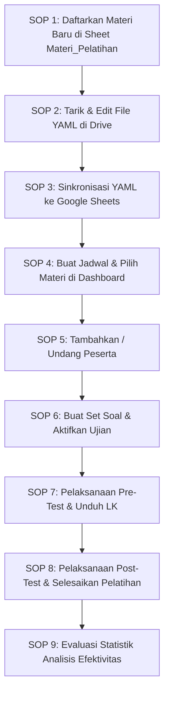

# Panduan Pengembang & SOP Modul Pelatihan (ToT)
**Sistem Pengawas KBC**

---

## 1. Daftar Fitur Utama Modul Pelatihan

Bagi pengembang yang akan memelihara atau menambahkan fitur, berikut adalah peta fitur yang saat ini berjalan di Modul Pelatihan:

1.  **Manajemen Jadwal Pelatihan**:
    *   Pembuatan jadwal baru (Draft) berbasis wilayah provinsi pelatih.
    *   Pembatasan penyuntingan jadwal hanya pada status `draft`.
2.  **Manajemen Peserta Dinamis**:
    *   Pendaftaran langsung (*Direct Add*) melalui pencarian NIP/Nama pengawas se-provinsi.
    *   Pendaftaran mandiri (*Self-Enrollment*) oleh peserta menggunakan 4-karakter kode undangan unik.
    *   Pembatasan kapasitas peserta maksimal (`MAX_PESERTA_PER_PELATIHAN = 50`).
3.  **Penyusunan Materi & Lembar Kerja (LK)**:
    *   Pemilihan materi dari pustaka materi global (*multi-select*).
    *   Integrasi tautan modul dan lembar kerja (Google Drive/Spreadsheet) yang disinkronkan secara langsung.
4.  **Grading Engine Pre & Post Test Otomatis**:
    *   Pengacakan soal (*shuffling*) berbasis *seed* deterministik per peserta.
    *   Penilaian otomatis di sisi server (*Server-Side Grading*) untuk 4 tipe soal: Pilihan Ganda (*Radio*), Benar/Salah (*Boolean*), Pilihan Ganda Majemuk (*Checkbox* dengan penalti jawaban salah), dan Menjodohkan (*Matching*).
    *   Pengelompokan nilai berdasarkan Kategori Kompetensi secara dinamis.
5.  **Analisis Efektivitas Pelatihan (Statistik)**:
    *   Pengujian hipotesis perbedaan rata-rata nilai Pre-Test dan Post-Test menggunakan metode *Paired T-Test*.
    *   Perhitungan ukuran efek (*Effect Size*) menggunakan formula *Cohen's d* untuk mengukur signifikansi praktis peningkatan kompetensi peserta.

---

## 2. Struktur Folder & Tata Letak Berkas (Folder Directory Structure)

Pengembang harus mematuhi struktur penempatan berkas baik di repositori kode (Google Apps Script) maupun di Google Drive agar integrasi parser YAML berjalan lancar.

### 2.1 Struktur Repositori Kode (GAS Project)
```text
/Pengawas
├── docs/
│   ├── pelatihan.md               # Software Design Document (SDD) Modul Pelatihan
│   └── sop_pelatihan.md           # [Berkas Ini] Panduan Developer & SOP Penggunaan
├── Pelatihan.js                   # Logic Controller & API CRUD Pelatihan
├── PrePostTest.js                 # Parser YAML, Shuffling Engine, & Grading Logic
├── Materi.js                      # Pengelolaan Pustaka Materi Umum
├── js-pelatihan.html              # UI View & Controller (PelatihanManager) Instruktur
├── js-peserta-pelatihan.html      # UI View & Controller (Peserta) Dashboard Peserta
└── js-pelatihan-analisis.html     # UI View & Statistik (T-Test & Cohen's d)
```

### 2.2 Struktur Penyimpanan Google Drive
Aplikasi membaca dan menulis file konfigurasi materi dari Google Drive. Struktur folder di bawah parent folder database utama (`APP_DB_ID`) adalah sebagai berikut:

```text
[Parent Folder Aplikasi] (APP_DB_ID)
└── pelatihan/                     # Dibuat otomatis oleh sistem jika belum ada
    ├── Pelatihan_KBC_Angkatan_1/  # Folder sesuai nama/judul materi (sanitized)
    │   ├── template.yaml          # Deskripsi materi & Lembar Kerja (LK)
    │   └── soal.yaml              # Bank soal ujian Pre & Post Test
    └── Manajemen_Madrasah/
        ├── template.yaml
        └── soal.yaml
```

---

## 3. Spesifikasi Template YAML

Pengembang wajib mengikuti struktur YAML berikut agar proses parsing di file `PrePostTest.js` (`parsePrePostYaml_`) tidak menghasilkan error.

### 3.1 Spesifikasi `template.yaml` (Materi & Lembar Kerja)
File ini mendefinisikan pustaka dokumen pendukung materi dan lembar kerja yang wajib diakses oleh peserta.

```yaml
deskripsi: "Pelatihan ini memberikan pemahaman mendalam tentang manajemen madrasah..."
pre_post_test:
  pre_test_url: ""
  post_test_url: ""
lembar_kerja:
  - judul: "LK 1: Pemetaan Masalah Madrasah"
    url: "https://docs.google.com/spreadsheets/d/ID_SPREADSHEET_LK1/edit"
  - judul: "LK 2: Rencana Tindak Lanjut (RTL)"
    url: "https://docs.google.com/spreadsheets/d/ID_SPREADSHEET_LK2/edit"
materi:
  - judul: "Bahan Bacaan Modul Kepemimpinan"
    url: "https://drive.google.com/file/d/ID_FILE_MODUL/view"
```

### 3.2 Spesifikasi `soal.yaml` (Pre-Test & Post-Test)
File ini mendefinisikan seluruh butir soal ujian evaluasi. Terdapat 4 tipe soal yang didukung:

```yaml
title: "Pre/Post Test Pemahaman Manajemen Madrasah"
description: "Soal evaluasi pemahaman baseline untuk pengawas madrasah"
shuffle_questions: true        # Mengacak urutan soal untuk tiap peserta
shuffle_options: true          # Mengacak urutan pilihan jawaban (kecuali tipe boolean)
time_limit_minutes: 30         # Batas waktu pengerjaan dalam menit

questions:
  # 1. Tipe Soal Pilihan Ganda (radio)
  - type: radio
    name: q1
    label: "Apa fungsi utama dari Rencana Kerja Madrasah (RKM)?"
    options:
      - "Sebagai dokumen formalitas akreditasi saja"
      - "Pedoman arah pengembangan madrasah jangka menengah"
      - "Laporan pertanggungjawaban penggunaan dana BOS"
      - "Dokumen evaluasi harian guru"
    answer: "Pedoman arah pengembangan madrasah jangka menengah"
    category: "Perencanaan"

  # 2. Tipe Soal Benar/Salah (boolean)
  - type: boolean
    name: q2
    label: "Evaluasi Diri Madrasah (EDM) wajib dilakukan minimal sekali dalam setahun."
    answer: "Benar"
    category: "Evaluasi"

  # 3. Tipe Soal Pilihan Ganda Majemuk (checkbox)
  # Catatan: Gunakan format array [] pada field answer.
  - type: checkbox
    name: q3
    label: "Pilih komponen indikator dalam Standar Nasional Pendidikan (SNP) yang dinilai dalam EDM (Pilih semua yang benar):"
    options:
      - "Standar Isi"
      - "Standar Sarana dan Prasarana"
      - "Standar Pembiayaan"
      - "Standar Kecantikan Lingkungan"
    answer: 
      - "Standar Isi"
      - "Standar Sarana dan Prasarana"
      - "Standar Pembiayaan"
    category: "Standar Mutu"

  # 4. Tipe Soal Menjodohkan (matching)
  # Catatan: Tuliskan left-item beserta daftar pilihannya di right_options, 
  # dan definisikan pemetaan kunci jawaban yang tepat pada field answer.
  - type: matching
    name: q4
    label: "Pasangkan istilah manajemen berikut dengan definisinya yang tepat:"
    pairs:
      - left: "Rencana Kerja Tahunan (RKT)"
        right_options:
          - "Rencana operasional madrasah yang dilaksanakan dalam kurun waktu 1 tahun"
          - "Proses penilaian internal untuk memetakan kekuatan dan kelemahan madrasah"
      - left: "Evaluasi Diri Madrasah (EDM)"
        right_options:
          - "Rencana operasional madrasah yang dilaksanakan dalam kurun waktu 1 tahun"
          - "Proses penilaian internal untuk memetakan kekuatan dan kelemahan madrasah"
    answer:
      "Rencana Kerja Tahunan (RKT)": "Rencana operasional madrasah yang dilaksanakan dalam kurun waktu 1 tahun"
      "Evaluasi Diri Madrasah (EDM)": "Proses penilaian internal untuk memetakan kekuatan dan kelemahan madrasah"
    category: "Istilah Manajemen"
```

---

## 4. Standar Operasional Prosedur (SOP) Pembuatan & Eksekusi Modul

Untuk menstandardisasi cara pembuatan konten pelatihan hingga pelaksanaannya, ikuti SOP langkah-demi-langkah berikut:



### SOP 1: Pendaftaran Materi Baru
1.  Buka Google Sheet database utama aplikasi.
2.  Pilih sheet `Materi_Pelatihan`.
3.  Tambahkan baris baru dengan mengisi kolom `materi_id` (contoh: `MAT-KBC-01`), `judul_materi`, dan `deskripsi`. Kosongkan kolom `konfigurasi_template` dan `konfigurasi_soal` terlebih dahulu.

### SOP 2: Pembuatan Berkas YAML di Google Drive
1.  Buka dashboard Pelatih pada aplikasi web.
2.  Masuk ke menu **Materi** dan pilih tombol **Sinkronisasi YAML** pada materi terkait.
3.  Sistem secara otomatis akan membuat folder khusus materi tersebut di Google Drive aplikasi dan membuat file contoh: `template.yaml` serta `soal.yaml`.
4.  Buka link Google Drive tersebut, edit isi file `template.yaml` (tambahkan url LK) dan `soal.yaml` (tulis butir-butir soal evaluasi sesungguhnya) sesuai spesifikasi pada Bab 3.

### SOP 3: Sinkronisasi YAML ke Google Sheets
1.  Kembali ke aplikasi web, pada halaman sinkronisasi materi, klik tombol **Sinkronkan Data**.
2.  Sistem akan mengunduh teks YAML, mem-parsing formatnya ke JSON (untuk template), lalu menyimpannya ke kolom `konfigurasi_template` dan `konfigurasi_soal` pada sheet `Materi_Pelatihan`.
3.  *Troubleshooting*: Jika gagal, periksa apakah terdapat kesalahan penulisan spasi/indentasi (*syntax error*) pada berkas YAML di Google Drive Anda.

### SOP 4: Pembuatan Jadwal Pelatihan
1.  Pilih menu **Kelola Pelatihan** $\rightarrow$ klik **+ Buat Jadwal**.
2.  Isi Judul, Deskripsi, Tanggal Mulai, dan Tanggal Selesai.
3.  Centang materi yang telah disinkronkan sebelumnya, lalu klik **Simpan Jadwal**. Status awal pelatihan adalah `draft`.

### SOP 5: Pendaftaran & Undang Peserta
1.  Masuk ke detail pelatihan yang baru dibuat.
2.  Pada tab **Peserta**, tambahkan peserta melalui tombol **+ Add** (mencari pengawas se-provinsi) atau bagikan **Kode Undangan** 4-karakter yang tertera di layar agar peserta dapat bergabung sendiri.
3.  Batas jumlah peserta adalah maksimal 50 orang.

### SOP 6: Pembuatan Set Soal & Aktivasi Pelatihan
1.  Buka tab **Pre/Post Test** pada halaman detail pelatihan.
2.  Klik tombol **Buat Set Soal dari Materi Terpilih**. Sistem akan menyusun bank soal gabungan dari materi-materi yang terdaftar dalam jadwal tersebut.
3.  Kembali ke bagian bawah halaman detail pelatihan, klik tombol **Aktifkan Pelatihan** (status pelatihan berubah dari `draft` menjadi `aktif`).

### SOP 7: Pelaksanaan Pre-Test
1.  Pada tab **Pre/Post Test**, klik tombol **Buka Ujian Pre-Test**.
2.  Instruksikan peserta untuk masuk ke dashboard mereka, mengakses materi, mengunduh lembar kerja, dan mengerjakan Pre-Test sebelum materi pelatihan dipaparkan.
3.  Pantau jumlah peserta yang telah mengumpulkan melalui indikator *"Sudah mengumpulkan: X orang"*.
4.  Setelah durasi pengerjaan selesai, klik tombol **Tutup Ujian Pre-Test** untuk mencegah pengiriman jawaban susulan.

### SOP 8: Pelaksanaan Post-Test & Penutupan Pelatihan
1.  Setelah penyampaian materi dan pengerjaan LK selesai, masuk kembali ke tab **Pre/Post Test**.
2.  Klik tombol **Buka Ujian Post-Test**. Instruksikan peserta untuk mengerjakan ujian akhir.
3.  Setelah selesai, klik **Tutup Ujian Post-Test**.
4.  Klik tombol **Selesaikan Pelatihan** di bagian bawah halaman. Pelatihan berstatus `selesai` dan tidak dapat diubah lagi datanya.

### SOP 9: Analisis Hasil Pelatihan
1.  Buka tab **Analisis** di halaman detail pelatihan.
2.  Klik **Buka Analisis Statistik**.
3.  Sistem secara otomatis akan menghitung uji signifikansi *Paired T-Test* dan kekuatan efek peningkatan (*Cohen's d*) berdasarkan perbandingan skor Pre-Test dan Post-Test. Gunakan data ini sebagai laporan pertanggungjawaban efektivitas pelatihan.
